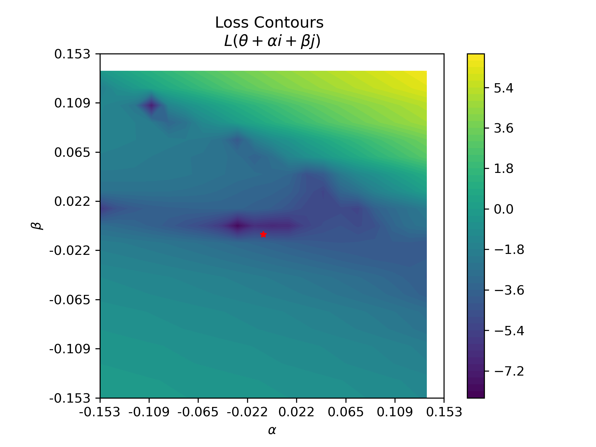
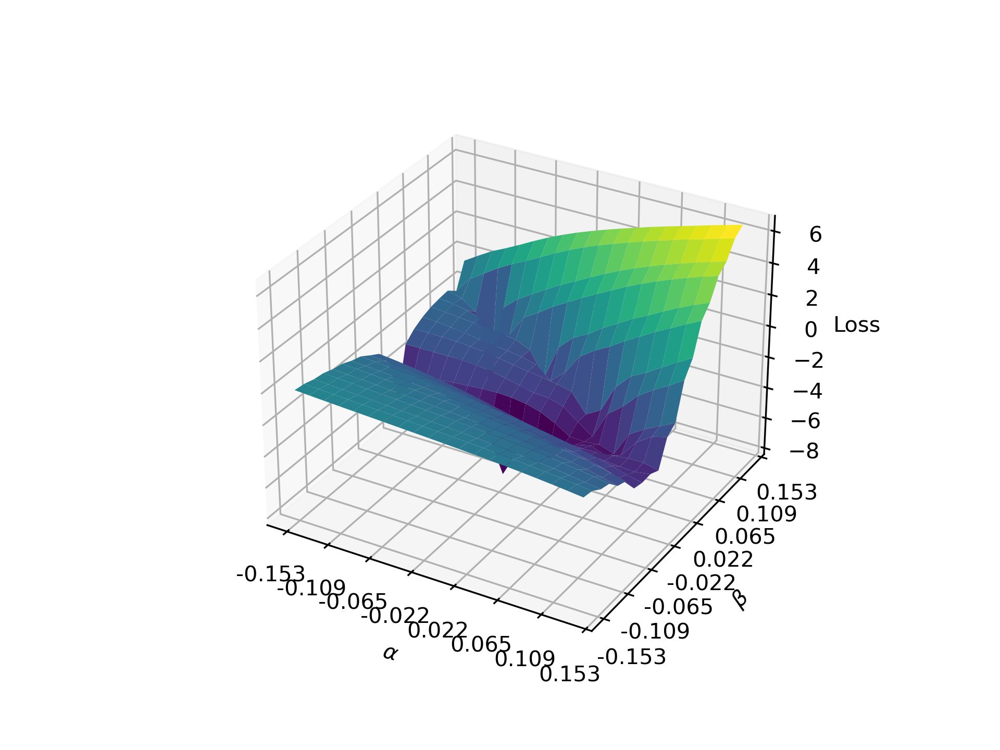

# loss_landscapes_demo

Jupyter notebook which calculates the loss landscape of an ALIGNN model.

## Installation

`conda env create -f environment.yml`

The following packages are installed using `conda`:
- python==3.10
- [alignn](https://github.com/usnistgov/alignn)
- matplotlib
- torchinfo
- ipykernel
- ipympl
- jupyter

An additional package, `loss_landscapes` is cloned from [this repo](https://github.com/marcellodebernardi/loss-landscapes) as a command in the notebook.

Any attempt at a `cuda` compatible installation is omitted, and the `dgl` dependency for `alignn` is ignored.

# yaofehlis
If I get an error, it may be CUDA installation related. 